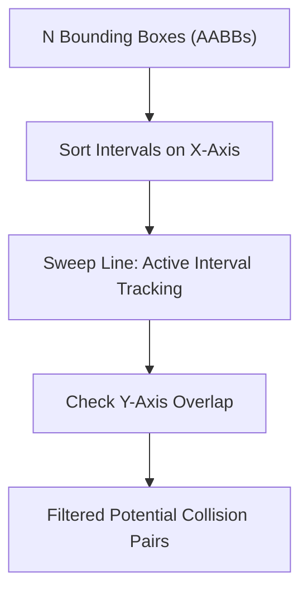

# Sweep-and-Prune Broadphase Collision Skill

Robust, zero-dependency Python implementation of the **Sweep-and-Prune (SAP)** algorithm for broadphase collision filtering.

## Features
- **Early Rejection Pruning**: Rapidly skips disjoint objects along sorted 1D coordinate intervals.
- **Dimension Reduction**: Cuts quadratic \(O(N^2)\) narrowphase tests down to \(O(N \log N)\) candidate pairs.
- **Zero External Dependencies**: Pure Python standard library.
- **Native MCP Protocol**: JSON-RPC 2.0 stdio server compatible with Claude Desktop, Cursor, and Windsurf.

## Architecture

